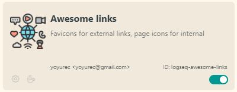
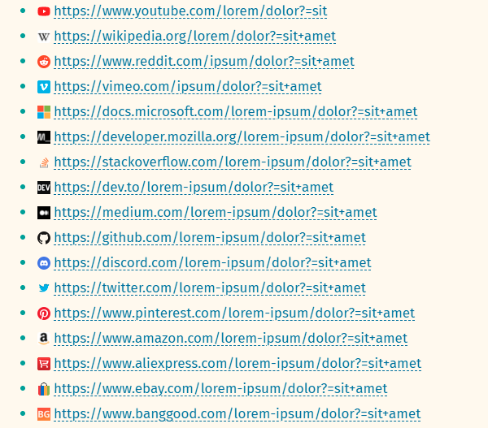

<h1 align="center">"Awesome Links" plugin for Logseq</h1>

    

* **Favicons** for external links! <a href="#-auto-favicons-for-external-links">🡖</a>
* **Pages icons** for internal links <a href="#-page-icons">🡖</a>
* Page icons`icon::`extended from Emoji to hundreds icons set via Nerd fonts support <a href="#-custom-page-icons">🡖</a>
* Custom **Journal icons** <a href="#-journal-icon">🡖</a>

## If you ❤ what i'm doing - you can support my work! ☕

## Install
From Logseq store - `Plugins -> Marketplace`.

## Recommended plugins/themes
* 🐱‍👤 [Solarized Extended](https://github.com/yoyurec/logseq-solarized-extended-theme) theme
* ⚡ [Awesome UI](https://github.com/yoyurec/logseq-awesome-ui)
* 📰 [Banners](https://github.com/yoyurec/logseq-banners-plugin)
* 📌 [Sticky Headers](https://github.com/yoyurec/logseq-sticky-headers)

## Features

### ⭐ Auto favicons for external links

### ✨ Page icons

Enable feature to show Logseq page (or aliased page) icon for internal links in content.
In addition you can config icon inheriting from related page (or its alias) proprty, to avoid manual setting `icon::` for common pages.
For ex.:
* create "Projects" page, set `icon::` for it
* create "Some project" page, set `page-type:: [[Projects]]`
* set in plugin settings "Inherit icon from..." `page-type`
* ...and all pages with `page-type:: [[Projects]]` will have inherited "Projects" page icon!

### ✨ Custom page icons

3600+ icons combined from popular sets (Font Awesome, Material Design, Seti-UI, etc...)!
Native Logseq props `icon::` extended with Nerd icons font:
* Search in collection ([Icons Cheat Sheet](https://www.nerdfonts.com/cheat-sheet)),
* select
* press "Copy icon",
* paste to `icon::` props

Banners & Tabs plugin support included 😎

### ✨ Journal icon

Can be customized in settings.

## What is Logseq?
Logseq is a privacy-first, open-source knowledge base. Visit https://logseq.com for more information.

## Support
* Read about Logseq plugin updates on Dicscord - https://discord.com/channels/725182569297215569/896368413243494430
* Ask about Logseq plugins on Dicscord - https://discord.com/channels/725182569297215569/752845167030960141
* If you have any questions, issues or feature request, use the issue submission on GitHub: https://github.com/yoyurec/logseq-awesome-links/issues

## Credits
* Icon - https://www.flaticon.com/free-icon/social-media_4089948?related_id=4089948

## License

[MIT License](./LICENSE)
